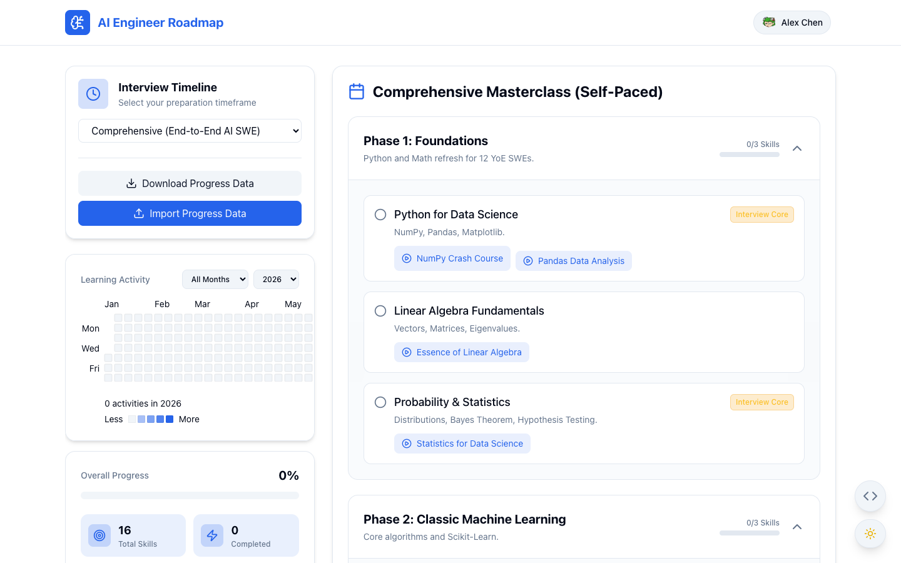
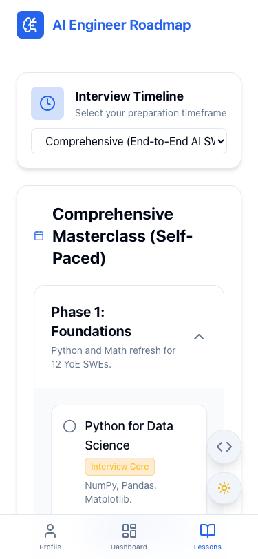

# AI Engineer Roadmap

A modern, offline-first React application designed to guide Software Engineers through their transition into Artificial Intelligence. Built with a beautiful glassmorphism UI, gamification, and rich interactive components.

## Screenshots

|                                 Desktop View                                 |                                Mobile View                                 |
| :--------------------------------------------------------------------------: | :------------------------------------------------------------------------: |
|  |  |

## Features

- **Interactive Learning Roadmap**: Step-by-step curriculum covering Python Basics, ML Fundamentals, Deep Learning (PyTorch), LLMs, MLOps, and more.
- **Shareable Profiles & Portfolios**: Generate a unique, encrypted share link of your learning progress. Viewers can see your custom avatar, earned badges, and dynamically inferred suitable job roles based on the exact skills you've completed!
- **Activity Calendar Heatmap**: Visually track your daily learning streak with a GitHub-style activity graph. Includes Year and Month filters.
- **Gamification & Badges**: Earn achievements like "First Steps" and "Halfway There" as you progress through the curriculum.
- **Customizable Avatar**: Pick from 15 diverse, randomly generated avatars (incorporating various art styles like adventurers, bots, and shapes) using the DiceBear API.
- **Dynamic Interview Timeline**: Adjust your roadmap pacing (1 Month, 3 Months, 6 Months, or End-to-End). The curriculum instantly filters out lower-priority skills depending on your timeframe to optimize your interview prep.
- **Offline-First & Data Portability**: All progress is saved automatically to `localStorage`. You can securely Export/Import your `.json` data to sync across devices (includes strict data-type validation).
- **Mobile Optimized**: Features a dedicated sticky bottom navigation bar on mobile devices to easily switch between your Profile, Dashboard, and Lessons.
- **Dynamic Theming**: Seamlessly switch between Light and a premium Emerald Green Dark Mode.

## Technology Stack

- **Framework**: React.js
- **Styling**: Tailwind CSS (with custom CSS variables for theming)
- **Icons**: Lucide React
- **Animations**: Framer Motion
- **Charts/Graphs**: Recharts & React Activity Calendar

## Getting Started

### Prerequisites

Make sure you have [Node.js](https://nodejs.org/) installed on your machine.

### Installation

1. Clone the repository and navigate to the project directory:

   ```bash
   cd ai-roadmap
   ```

2. Install dependencies:

   ```bash
   npm install
   ```

3. Setup Environment Variables:

   Create a `.env` file in the root directory and add a secret key used for encrypting shareable profile links:

   ```bash
   echo "REACT_APP_SHARE_KEY=ai-roadmap-super-secret-key" > .env
   ```

4. Start the development server:

   ```bash
   npm start
   ```

5. Open [http://localhost:3000](http://localhost:3000) to view it in your browser.
